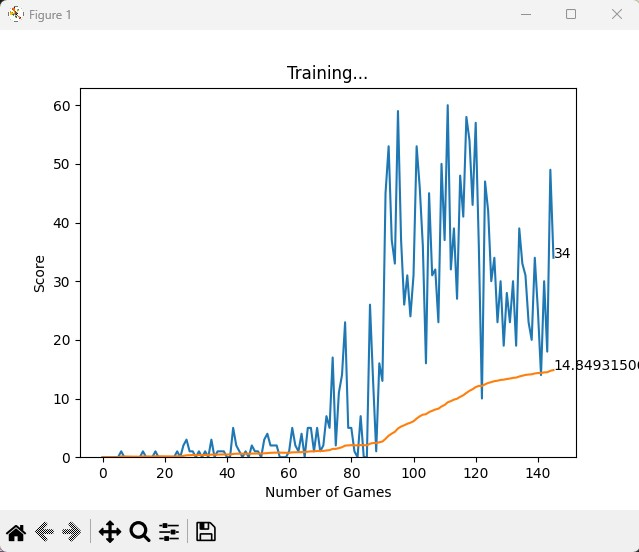

# AI For Snake Game using DQN

---

## Overview

This project employs Deep Q-Network (DQN) to develop an AI capable of plaing the classic Snake game. The AI learns to play the game by maximizing its score through reinforcement learning. The project includes a custom implementation of the Rainbow DQN algorithm, prioritized experience replay, and a dueling noisy neural network.

---

## Table of Contents

- [Overview](#overview)
- [Installation](#installation)
- [Usage](#usage)
- [Output](#output)

---

## Installation

```bash
pip install torch
pip install numpy
pip install matplotlib
pip install ipython
pip install pygame

```

---

## Usage

1. Run cd into the project folder
2. Run python main.py in the terminal

---

## Output



